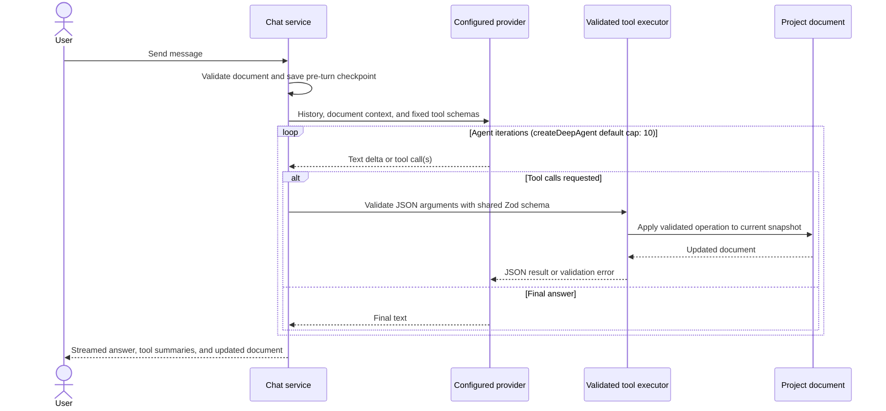

# AI agent

The optional AI editing layer lives in `electron/ai-edition/` and `src/components/ai-edition/`. It connects the editor's chat UI to configured language models and exposes a fixed set of validated operations over the shared project document.

## What it is and what gates it

`AI_FEATURES_ENABLED` in `src/components/video-editor/featureFlags.ts` gates the provider settings, chat panel, suggestions, and checkpoint-restore UI. Its current default is `true`, so the AI surface is enabled unless the source constant is changed.

The boundary is intentionally narrow: the flag gates only the LLM and agent UI. The editing model, project panel, timeline, transcript and export surfaces ship to every user. Local Whisper transcription is privacy-preserving and is not behind this flag.

## The tool loop

The deep-agent service builds one `createDeepAgent` instance per user turn. It streams model text and tool lifecycle events to the renderer while a mutable document holder ensures that each call in the turn sees the preceding call's result.

OpenScreen does not override `createDeepAgent`'s recursion limit, so the installed deep-agent runtime's default cap is 10 model/tool iterations for a turn.

## Tool schema

The model never free-writes the project document. It can only call the fixed tool set declared in `agent-tools.ts`; the executor parses JSON, validates arguments with Zod, and returns either a new schema-valid snapshot or an error. The tools operate on the same [document model](document-model.md) as manual editing.

| Tool | What it does | What it mutates |
|---|---|---|
| `getCurrentDocument` | Reads a compact project, asset, clip, trim, and modifier snapshot with explicit time bases. | Nothing. |
| `getTranscript` | Reads up to 800 transcript segments for an asset or the primary asset. | Nothing. |
| `addTrim` | Adds a source-time cut inside a clip. | `timeline.trimRanges`. |
| `setTrim` | Moves or resizes an existing source-time trim. | The matching `timeline.trimRanges` entry. |
| `setClipRange` | Changes a clip's source in/out points and relays clips back-to-back. | The clip range and any anchored regions clamped or removed by the shared timeline mutator. |
| `replaceTimeline` | Rebuilds the primary-asset timeline from kept source-time intervals; refuses to discard user-placed clips. | Timeline clips and trim ranges. |
| `addZoom` | Adds a clip-anchored zoom over virtual timeline time. | `zoomRanges`. |
| `setZoom` | Moves, resizes, or restyles a zoom pill. | The clip-anchored `zoomRanges` fragments represented by that pill. |
| `addSpeed` | Adds a clip-anchored speed region over virtual timeline time. | `legacyEditor.speedRegions`. |
| `setSpeed` | Moves, resizes, or changes an existing speed pill. | The corresponding `legacyEditor.speedRegions` fragments. |
| `addAnnotation` | Adds a positioned text annotation over virtual timeline time. | `annotations`. |
| `setAnnotation` | Moves, resizes, or changes an annotation's text. | The corresponding clip-anchored `annotations` fragments. |
| `addCameraFullscreen` | Adds a camera-fullscreen region over virtual timeline time. | `legacyEditor.cameraFullscreenRegions`. |
| `setCameraFullscreen` | Moves or resizes a camera-fullscreen pill. | The corresponding `legacyEditor.cameraFullscreenRegions` fragments. |
| `removeTrim` | Deletes a trim so its source span plays and exports again. | `timeline.trimRanges`. |
| `removeModifier` | Resolves and deletes a zoom, speed, annotation, or camera-fullscreen modifier by ID. | The matching modifier collection. |
| `removeClip` | Deletes a placed clip, closes the gap, and drops effects anchored only to it. | Timeline clips and affected anchored modifiers. |

Clips and trims use source time. Zoom, speed, annotation, and camera-fullscreen tools use virtual edited-timeline time; the executor converts these spans to the clip-anchored millisecond representation used by the document.

## Checkpoints and undo

Before a user message starts an agent turn, `chat-service.ts` clones the current document and associates it with that user message. All write calls produced by the turn operate from that checkpoint lineage, so restoring the message reverts the complete tool batch as one undo unit rather than undoing each model call separately. Rewind also truncates later conversation messages and invalidates later checkpoints.

## Context management

`chat-compaction.ts` uses a four-characters-per-token estimate, adds tool-summary text, and compares history with an 80,000-token budget. Once a session has at least four messages and reaches 70% of that budget, it asks the active provider to summarize the older half at a user-message boundary and inserts an `Earlier context` assistant message while retaining recent turns. Compaction failure leaves history unchanged. The chat path also sends only the latest 20 stored messages to the agent.

`chatBudget.ts` duplicates the same lightweight estimate in the renderer so Electron-only code is not bundled into the UI. It drives the context-percentage badge and the manual compact action. The heuristic deliberately leaves room for the system prompt and tool payloads; it is not a provider tokenizer.

## Sessions

Sessions are scoped first by project ID and then by session ID. Each session stores a generated ID, project ID, title, creation timestamp, messages, and per-user-message checkpoint references. The renderer can create, select, rename, delete, compact, and rewind sessions through the native bridge.

Chat sessions and checkpoints live only in nested process-memory `Map` objects in `chat-service.ts`. They are not written to project files or user data, so restarting Electron loses the conversation and its restore checkpoints. Provider configuration and encrypted credentials are separate and do persist.

## Known gaps

- Chat sessions and message checkpoints have no durable persistence.
- `allowAgentEdits` is exposed in provider settings, but `chat-service.ts` only reads it; the deep-agent tool list and mutating executor do not enforce it. There is therefore no working confirmation or permission gate before write tools.
- The deep-agent instance is rebuilt for every turn without a LangGraph checkpointer, so stateful agent threads do not persist independently of the explicit chat history.
