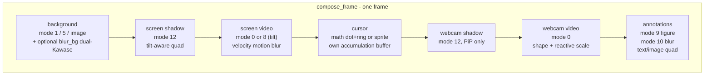

# Native compositor

`poc-d3d/` is the Rust + Direct3D 11 crate behind both the live preview and the MP4
export. It exposes its compositor and pipeline to Electron through a small
napi-rs addon (`compositor-view-napi/`) loaded by
[`compositorViewService`](../../electron/native-bridge/services/compositorViewService.ts).
The whole GPU-resident path lives here — `demux → decode → composite → encode → mux`,
zero CPU readback between stages — and is shared, with the same scene contract, by
[preview.md](preview.md) (frame-by-frame RGBA8 pull) and
[export-pipeline.md](export-pipeline.md) (multiclip MP4 write). The performance
numbers and the rejected alternatives that drove the design live in
[engineering/rendering-performance.md](../engineering/rendering-performance.md).

A single `ID3D11Device` ([`poc-d3d/src/d3d.rs`](../../poc-d3d/src/d3d.rs))
is shared by every consumer on the path: the ffmpeg `D3D11VA` decoder, the HLSL
compositor, the `h264_amf` encoder, and the live swapchain. It is created with
feature level **11_1**, the flags `VIDEO_SUPPORT | BGRA_SUPPORT` (`VIDEO_SUPPORT`
is required for `D3D11VA`; `BGRA_SUPPORT` enables the DirectWrite/Direct2D path
used by text annotations), and `ID3D10Multithread::SetMultithreadProtected(TRUE)`
— ffmpeg's decoder thread and the render loop touch the device concurrently,
and without that flag the runtime corruption is silent.

## Module map

| source | responsibility |
|---|---|
| [`poc-d3d/src/lib.rs`](../../poc-d3d/src/lib.rs) | crate root: exposes `run()` (CLI / bench / GUI dispatcher), re-exports every module |
| [`poc-d3d/src/d3d.rs`](../../poc-d3d/src/d3d.rs) | the single `ID3D11Device` (feature level 11_1, `VIDEO_SUPPORT`, multithread-protected) |
| [`poc-d3d/src/ffi.rs`](../../poc-d3d/src/ffi.rs) | bindgen-generated `libav*` bindings (ffmpeg 8.x headers) |
| [`poc-d3d/src/compositor.rs`](../../poc-d3d/src/compositor.rs) | HLSL compositor — every per-frame pass (`compose_frame`, background, screen, webcam, cursor, annotations, shadows, blur) |
| [`poc-d3d/src/scene.rs`](../../poc-d3d/src/scene.rs) | the `Scene` struct parsed from the app's `SceneDescription` JSON |
| [`poc-d3d/src/regions.rs`](../../poc-d3d/src/regions.rs) | zoom / speed / Full Camera regions — envelope shapes and per-frame state sampling |
| [`poc-d3d/src/pipeline.rs`](../../poc-d3d/src/pipeline.rs) | demux + `D3D11VA` decode + composite + AMF encode + mux (`run_c0` for decode/encode only, `run_composited` for the full path) |
| [`poc-d3d/src/audio.rs`](../../poc-d3d/src/audio.rs) | per-clip audio decode, swresample → f32 planar 48 kHz stereo, WSOLA speed stretch, multi-track mix, AAC encoder |
| [`poc-d3d/src/cursor.rs`](../../poc-d3d/src/cursor.rs) | `.cursor.json` parser + interpolated cursor track (position, click bounces, adaptive follow samples) |
| [`poc-d3d/src/text.rs`](../../poc-d3d/src/text.rs) | DirectWrite + Direct2D text rasterisation for annotation labels, cached per (content, style, box) |
| [`poc-d3d/src/text_anim.rs`](../../poc-d3d/src/text_anim.rs) | text-annotation appearance animations (port of the TS animation curves, in fractions of the output short side) |
| [`poc-d3d/src/config.rs`](../../poc-d3d/src/config.rs) | cumulative bench configs C0..C8 (each adds one layer: composite, rounded corners, shadow, background blur, zoom, layout animation, cursor, motion blur) |
| [`poc-d3d/src/live.rs`](../../poc-d3d/src/live.rs) | off-screen view: `Player` + `Compositor::compose_frame` → RGBA8 staging texture, pulled by the napi addon |
| [`poc-d3d/src/app.rs`](../../poc-d3d/src/app.rs) | standalone Win32 GUI (combo preset, Play/Pause, Export, progress bar) — wraps the measured pipeline for interactive demo |
| [`poc-d3d/src/main.rs`](../../poc-d3d/src/main.rs) | thin `main` that calls `lib::run()` |
| [`poc-d3d/src/shaders.hlsl`](../../poc-d3d/src/shaders.hlsl) | all GPU effects (modes 0/1/5/8/9/10/12 — see pipeline below), compiled at runtime via Fxc |

## The compositing pipeline

Every visible frame is rasterised into one RGBA render target
(`OUT_W × OUT_H = 1920×1080`, then optionally bilinearly resized to the real
output aspect). `Compositor::compose_frame`
([`poc-d3d/src/compositor.rs:1421`](../../poc-d3d/src/compositor.rs))
runs one fixed draw order — derived from the per-frame math it performs, not
from any list the caller can reorder — and `shaders.hlsl` keys each effect off
the `mode` field of the same `LayerCB` struct, so the modes below are exactly
what `shaders.hlsl` actually implements:

1. **Background** (the wallpaper). `mode = 1` for a solid colour
   ([`compositor.rs:1761`](../../poc-d3d/src/compositor.rs)),
   `mode = 5` for a CSS gradient
   ([`compositor.rs:1765`](../../poc-d3d/src/compositor.rs)), or a cover-fitted
   image loaded through `draw_image_bg`
   ([`compositor.rs:1156`](../../poc-d3d/src/compositor.rs)). When the
   scene's `effects.blur` is on, `blur_bg` (dual-Kawase, ~18 px) blurs whatever
   was just drawn — that is what "Blur BG" does, mirroring the web
   `frameRenderer.blurredBackgroundLayer`
   ([`compositor.rs:1807`](../../poc-d3d/src/compositor.rs)).
2. **Screen shadow.** Drop-shadow SDF; opacity scales with the `shadow`
   slider. The shadow tracks the rendered silhouette — a tilted plane gets a
   tilted shadow, not a rect shadow
   ([`compositor.rs:1885`](../../poc-d3d/src/compositor.rs) /
   [`compositor.rs:1882`](../../poc-d3d/src/compositor.rs), `mode = 12`).
3. **Screen video.** Cropped from the active clip's source, with the zoom region
   applied to its UVs and rounded corners via SDF. `mode = 0` for the standard
   quad ([`compositor.rs:1898`](../../poc-d3d/src/compositor.rs));
   `mode = 8` for the 3D tilt path (zoom `rotation: iso | left | right`,
   [`compositor.rs:1950`](../../poc-d3d/src/compositor.rs)). Motion blur
   uses the previous frame's UV delta as a per-pixel velocity vector and samples
   along it (the "blur by velocity" optimisation — early-outs on still frames).
4. **Cursor.** Math dot+ring by default; sprite (loaded from
   `cursor.cursorSpritePath`) when the app hands the native side a theme
   path. Motion blur is its own accumulation buffer (additive blend into an
   isolated RT, then "over"-composited onto the scene), independent of the
   scene's `effects.motionBlur`
   ([`compositor.rs:2038`](../../poc-d3d/src/compositor.rs) /
   [`compositor.rs:2060`](../../poc-d3d/src/compositor.rs)). Click
   bounce amplitude comes from the `.cursor.json` track
   ([`poc-d3d/src/cursor.rs`](../../poc-d3d/src/cursor.rs)).
5. **Webcam shadow.** Drawn only when `cfg.shadow` is on AND the layout is PiP
   (not the block layouts, which weld the camera flush to the screen — no
   floating bubble, no shadow). The strength fades to zero as the camera
   enters Full Camera mode
   ([`compositor.rs:2118`](../../poc-d3d/src/compositor.rs), `mode = 12`).
6. **Webcam video.** UV rectangle derived from the destination aspect, with
   mirror, mask shape (rectangle / circle / square / rounded), and reactive
   scale applied
   ([`compositor.rs:2127`](../../poc-d3d/src/compositor.rs), `mode = 0`).
   Full Camera lerps the destination to `[0, 0, 1, 1]` and dissolves the mask
   shape — same rule as `computeCameraFullscreenRect` on the TS side.
7. **Annotations.** Highest layer. One full-frame `CopySubresourceRegion` of
   the composed scene is taken at the top of `draw_annotations` so that
   multiple blur annotations on the same frame read from a consistent snapshot
   of the underlying pixels
   ([`compositor.rs:2162`](../../poc-d3d/src/compositor.rs)).
   Per-annotation: figure (arrow, `mode = 9`), blur/mosaic (`mode = 10`),
   text (DirectWrite → D3D11 SRV, then `mode = 0`), image (cached per
   annotation id).



## Scene contract

The app hands the native compositor a flat JSON description once per document
or settings change. The TypeScript producer is
[`buildSceneDescription`](../../src/native/sceneDescription.ts); the Rust
mirror is the `Scene` struct in
[`poc-d3d/src/scene.rs`](../../poc-d3d/src/scene.rs). Field renames are
camelCase on both sides (`#[serde(rename_all = "camelCase")]`), so the wire
format is the same names a TS caller already writes. Three fields the
contract insists on carrying as **fractions** of their reference box, not
pixels, because the native side rasterises the preview into a small
contain-fitted frame and the export at full output size:

- `effects.roundnessFrac` — of the output frame's short side.
- `layout.screenRadiusFrac`, `layout.webcamRadiusFrac` — of their own box's
  short side (the only way two halves of a block layout can agree on a
  radius; see `compositor.rs` §1's comment on
  [`compositor.rs:1702`](../../poc-d3d/src/compositor.rs)).
- `annotation.x|y|w|h` and `annotation.text.fontSizeRel` — of the screen
  rect (annotations anchor to the screen box, not the output frame, and
  intentionally bypass the zoom transform).

The consumer is `Compositor::compose_frame`
([`compositor.rs:1421`](../../poc-d3d/src/compositor.rs)). It reads
the scene per frame, derives per-clip and per-frame values through
`Scene::for_clip_window`
([`scene.rs:436`](../../poc-d3d/src/scene.rs)) — which retains only the
regions whose `clipIndex` matches the clip being composed and which overlap
its source window — and only then issues GPU draws. Region visibility is
expressed as `[startSec, endSec)` intervals matched against `t = source_time`,
so a region straddling a clip boundary already arrives split per clip from
the TS `projectRegionsToSource` call. The struct's `#[serde(default)]`
fields (`webcamRect`, `screenRect`, `annotations`, `speedRegions`,
`cameraFullscreenRegions`, `layoutByClip`, `cropByClip`) keep older
payloads parseable so the addon's `require()` never breaks a saved project
mid-load.

## Audio

`audio.rs` ([`poc-d3d/src/audio.rs`](../../poc-d3d/src/audio.rs)) is the
single audio path for the export. Per clip, it opens the source container,
enumerates **every** audio stream (not just the first `av_find_best_stream`
returns), opens a `SwrContext` to convert each one to **planar f32, 48 kHz,
stereo** (the `AUDIO_OUTPUT_*` constants at the top of the file), and mixes
all streams into a single per-clip buffer by sample-aligned summation. The
alignment is the load-bearing detail: each track's first decoded frame
anchors its `origin_sec`, the seek is sized to the requested window, and
each track is recut to the same `[source_start_sec, source_end_sec)` —
pads in front for late-starting tracks, trims the pre-roll for early-decoded
ones — so a summing mixer is enough and a real mix matrix is not needed.

Speed regions apply after decode: WSOLA stretches each speed sub-segment to
its output frame count, sharing search positions across channels from a
mono down-mix (so the stereo image does not wander between channels).
Across segments, `build_audio_concat_plan` sizes each segment's PCM by
**integer accumulation of the per-segment rounded sample count**, never
`round(cumulativeSec * sampleRate)` — that single change is what keeps A/V
locked across a long multi-clip timeline. `assemble_concatenated_pcm`
copies each segment into its planned slot, truncating a too-long buffer and
zero-padding a too-short one so a small decode over/under-run cannot shift
the timeline, and applies a short equal-power fade (`cos` on the tail,
`sin` on the head, `cos² + sin² = 1`) at every internal boundary to suppress
the click where two recordings meet butt-joined — without shifting timing,
so A/V stays locked to the independently retimed video.

The live preview does not use this path. `live.rs`
([`poc-d3d/src/live.rs`](../../poc-d3d/src/live.rs)) only handles video;
audio is decoded and mixed by `audio.rs` for the export run and not for the
on-screen view, so editing playback is silent against the exported file.

## Build

The crate links `libav*` (ffmpeg) via bindgen
([`build.rs`](../../poc-d3d/build.rs) /
[`wrapper.h`](../../poc-d3d/wrapper.h)). ffmpeg is not vendored — the
path is pinned in `poc-d3d/.cargo/config.toml`:

```
[env]
FFMPEG_DIR = { value = "thirdparty/ffmpeg-n8.1.2-win64-lgpl-shared", relative = true }
LIBCLANG_PATH = "C:\\Program Files\\LLVM\\bin"
```

So the thirdparty ffmpeg is **`poc-d3d/thirdparty/ffmpeg-n8.1.2-win64-lgpl-shared`**
(the BtbN LGPL-shared build of ffmpeg-n8.1.2-22-g94138f6973, tag
`autobuild-2026-07-15-14-01`). It must be the **same build** that
`scripts/fetch-ffmpeg.mjs` vendorises into
`electron/native/bin/<tag>/` for packaging. The addon's `require()` loads
`avcodec-NN.dll` / `avformat-NN.dll` / etc. against the vendorised tree at
runtime; if those import names do not match the build the crate linked
against, the require fails on first use
(`compositorViewService` prepends the ffmpeg `bin` directory to `PATH`
before loading, so a system ffmpeg on `PATH` does not satisfy it either —
see [`compositorViewService.ts:206`](../../electron/native-bridge/services/compositorViewService.ts)).
The reason for the hard pin (no floating snapshot): the patch-level suffix
in `avcodec-NN.dll` is a build-id, not a soname, and changes between
autobuilds. A floated snapshot would compile fine and crash at runtime on
the first `require()`.

`x.bat` ([`poc-d3d/x.bat`](../../poc-d3d/x.bat)) sets up the toolchain
end-to-end: vcvars64 (MSVC + Windows SDK headers/libs for both the linker
and libclang), the ffmpeg `bin` directory on `PATH` (so the linker can
find `avcodec-NN.dll`'s import lib AND any DLL the crate emits resolves its
transitive imports at runtime), and `LIBCLANG_PATH` so bindgen can find
libclang. Then it calls `cargo`. Three modes:
`x.bat run --release` (GUI demo with preview + Export button),
`x.bat run --release -- --cfg C0..C8 --fixture fixture --repeat 3 --out out/`
(headless bench — the only numbers worth quoting per §10 of the bench
protocol), `x.bat run --release -- --live` (the off-screen embed path used
by the napi addon).

The ffmpeg build must be **LGPL-shared** (`*-lgpl-shared`), not the Gyan
GPL system build: GPL pulls x264/x265/xvid and would taint the app's MIT
licence. D3D11VA + AMF survive the LGPL-shared build (verified:
`avutil gpl=false amf=true`).

## Known gaps

- **No software/CPU fallback.** `d3d::Gpu::create`
  ([`poc-d3d/src/d3d.rs`](../../poc-d3d/src/d3d.rs)) requests
  `D3D_DRIVER_TYPE_HARDWARE` (no `WARP` / no `REFERENCE`) and pins
  `D3D_FEATURE_LEVEL_11_1` — any other feature level fails with `bail!`,
  and `VIDEO_SUPPORT` is mandatory for `D3D11VA`. A machine without a
  GPU that exposes FL 11_1 with video support will hard-fail at startup;
  there is no path that decodes on CPU or falls back to a reference
  rasteriser. The compositor is therefore unusable on virtualised
  environments that do not pass through a compatible adapter, and there
  is no second renderer behind it.
- **Software VP9 encoding is not supported.** A software VP9 encoder was
  implemented, measured too slow without a hardware VP9 path on the
  target GPU, and removed. The export pipeline now offers H.264 (AMF) and
  H.265; VP9 is not a runtime option.
- **Live preview is video-only** — `live.rs` does not decode or play audio.
  Editing playback is silent against the exported file; users hear sound
  only when the export runs. Documented in
  [preview.md](preview.md#known-gaps).