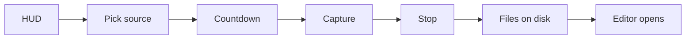

# Recording architecture

Recording is a cross-platform session coordinated by Electron and rendered by a platform capture path. The recorder and HUD live in `src/components/launch/` and `src/hooks/useScreenRecorder.ts`; native capture helpers live in `electron/native/`, while Linux uses Chromium's display-media APIs.

## Lifecycle

The HUD starts and controls a recording. The source selector chooses a display or window and the countdown gives the user time to prepare. Electron resolves the source and output paths, starts the selected capture backend, and records cursor telemetry alongside media. Stop finalizes the media and session files; the resulting paths are passed to the editor as recording assets.

## The HUD

`LaunchWindow` is the recording controller. Its control row exposes recording, pause, source, microphone, system-audio, webcam, cursor, settings, and stop/restart actions through the HUD controls. The overlay is click-through (`setIgnoreMouseEvents(true, { forward: true })` in `electron/windows.ts`), so it does not intercept the application being recorded; the HUD's own controls temporarily opt into pointer handling through the overlay IPC path.

Electron applies `setContentProtection(true)` to the HUD window (`electron/windows.ts:31`). This keeps the controller out of captures and also makes it invisible in screenshots. For a testing session only, `OPENSCREEN_DISABLE_CONTENT_PROTECTION=1` disables the protection; the code warns that the HUD then appears in captures. The tray icon is the reliable way to refocus OpenScreen or stop a recording when the click-through HUD is not convenient or is not visible.

## Capture backends

| Platform | Backend | Code | Produces |
| --- | --- | --- | --- |
| Windows | Windows Graphics Capture (WGC) helper (C++/Win32), with WASAPI and Media Foundation support | `electron/native/wgc-capture/` and `electron/windows.ts` | H.264 MP4 screen/window video; system/microphone AAC when enabled; webcam is muxed into the primary MP4 unless a separate webcam path is requested |
| macOS | ScreenCaptureKit helper (Swift), with AVFoundation/VideoToolbox encoding | `electron/native/screencapturekit/` and `electron/native/README.md` | H.264 MP4 screen/window video and ScreenCaptureKit system audio; microphone may be native where supported; webcam currently remains a separate Electron sidecar |
| Linux | Electron `getDisplayMedia` path | `src/hooks/useScreenRecorder.ts` and Electron recording IPC | Browser-recorded display/window media, with the session's separate media and telemetry files |

The division is an invariant: the native helper owns capture, timing, and encoding; Electron owns session orchestration, output-path selection, persistence, and editor handoff. Linux keeps those media responsibilities in Electron because it has no native helper path here.

## Helper contract

A native session is a child process boundary. Electron starts the platform helper with one structured JSON request and sends runtime commands on stdin; `stop` finalizes the output. The helper emits newline-delimited JSON events on stdout. The shared shape contains `schemaVersion`, `recordingId`, a `source` (display or window and its bounds), `video`, `audio`, optional `webcam`, optional cursor mode, and `outputs` paths. The helper reports `ready`, `recording-started`, warnings, errors, and `recording-stopped` events. Windows accepts legacy textual start/stop messages during compatibility handling; the structured events are the reference contract.

| Contract field or behavior | Windows | macOS |
| --- | --- | --- |
| Schema | `schemaVersion: 2` | `schemaVersion: 1` |
| Source identity | `sourceId`, `displayId`, optional `windowHandle` | `sourceId`, `displayId`, optional `windowId` |
| Video | FPS, dimensions, bitrate | FPS, dimensions, bitrate, and `hideSystemCursor` |
| Audio | System loopback and selected microphone flags/device metadata | System audio and microphone flags/device metadata; microphone support is runtime-gated |
| Webcam | Native Media Foundation first, exact Electron-resolved DirectShow fallback; muxed into primary MP4 by default | Electron sidecar attached to the session |
| Output | `screenPath`, session manifest, and optional `webcamPath` | `screenPath` and session manifest |
| Runtime control | stdin pause/resume/stop/cancel; JSON events plus legacy text compatibility | Process events and the same lifecycle commands as the process boundary evolves |

Electron resolves selected sources, devices, and paths before launching the helper. The helper does not guess a DirectShow camera: Windows receives the resolved selection. A helper error is reported explicitly rather than silently switching a Windows native feature to browser capture.

## Output files and sidecars

A session writes a screen video and a `.session.json` manifest. Windows normally muxes the webcam into that MP4; when `webcamPath` is supplied, it writes a separate webcam video. macOS currently writes the webcam as a separate Electron sidecar (`webcamVideoPath`) because native webcam composition is not part of the helper. Linux follows the Electron recorder's separate media-path convention. Audio that the selected backend captures is encoded into its screen output.

Cursor samples are persisted as cursor telemetry rather than baked into editable-overlay recordings. The loader resolves the sidecar at `<videoPath>.cursor.json` or through the recording links; see [cursor.md](cursor.md) for the telemetry format and rendering path.

## Known gaps

- A window with odd client dimensions can produce black video: H.264 encoding requires even dimensions (`electron/native/wgc-capture/src/wgc_session.cpp:38`).
- Stopping a recording can hang on the software encoder path (`electron/native/wgc-capture/src/main.cpp:755`).
- Linux/Wayland can produce no usable frames because Chromium initializes Vulkan against the Ozone Wayland backend.
- `preferSoftwareEncoder` is read when recording starts. The recorder has no UI for setting it; Windows also accepts `OPENSCREEN_WGC_PREFER_SOFTWARE_ENCODER=true` in the helper request path.
