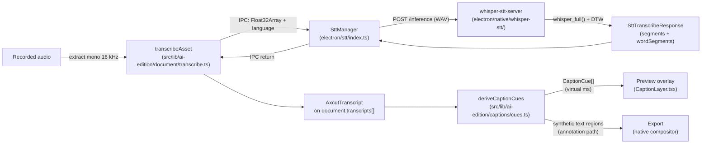

# Transcription and captions

OpenScreen turns recorded audio into on-device text, and renders that text as
captions over both the preview and the export. The recogniser runs natively on
the desktop — no network calls, no Python — and feeds a single transcript per
asset into a caption layer that derives its cues on every render. Code lives
in `electron/stt/` (main-process STT pipeline), `electron/native/whisper-stt/`
(the C++ helper that links whisper.cpp directly), and
`src/lib/ai-edition/captions/` (the caption layer that derives its cues from
the transcript).

## Pipeline



The renderer pieces — `transcribeMono16kToSegments`
(`src/lib/captioning/transcribe.ts`) called from `transcribeAsset`
(`src/lib/ai-edition/document/transcribe.ts`) — are a thin IPC adapter: the
audio crosses to the main process, the helper does the recognition, and the
result is mapped back onto the `AxcutTranscript` shape the rest of the editor
reads. From the moment that transcript is persisted, captions and the words
they show cannot drift — captions are a derived view, not a parallel store.

## The STT engine

The recogniser is **whisper.cpp**, embedded as a static library inside one
helper executable per desktop platform. whisper.cpp picks the actual compute
backend at runtime — Metal on Apple Silicon, Vulkan on Windows and Linux, CPU
fallback when no usable GPU or driver is present — so the renderer only knows
which backend the helper bound by reading the response field at
[`electron/stt/transcriptionContract.ts:35`](../../electron/stt/transcriptionContract.ts:35).
There is no OS-side GPU probing; `electron/stt/gpuDetector.ts` resolves the
per-platform binary name only, and the real backend is corrected from the
helper's `/inference` JSON.

Why whisper.cpp, in one paragraph: a single C++ dependency with native DTW
token timestamps for word-level timing, a portable runtime device selection
that covers Metal, Vulkan and CPU in one binary, and self-contained long-form
chunking (`whisper_full()` over recordings longer than 30 s) without manual
windowing on our side. Validation data — backend-by-backend WER and real-time
factors — lives in
[`tools/stt-eval/whispercpp-dtw-poc/REPORT.md`](../../tools/stt-eval/whispercpp-dtw-poc/REPORT.md).

### Per-platform backend

| Platform | Helper binary | Runtime device candidates |
|---|---|---|
| macOS arm64 | `whisper-stt-server-metal` | Metal, CPU |
| macOS x64 | `whisper-stt-server-cpu` | CPU |
| Windows x64 | `whisper-stt-server-vulkan` | Vulkan, CPU |
| Linux x64 | `whisper-stt-server-vulkan` | Vulkan, CPU |

whisper.cpp chooses the device in `whisper_backend_init`; the helper reports
what actually bound (via `ggml_backend_dev_name()`) and `SttManager` returns
it verbatim in the response.

### Word-level alignment (DTW token timestamps)

1. **Decode** — `whisper_full()` runs with the default sampling parameters
   (`WHISPER_SAMPLING_GREEDY`), returning phrase segments plus a per-token
   array.
2. **DTW timestamp** — every non-special token carries `t_dtw` in
   centiseconds from whisper.cpp's native DTW
   (`dtw_token_timestamps=true`, `dtw_aheads_preset=WHISPER_AHEADS_SMALL`,
   `flash_attn=false`, which together are the prerequisites for DTW to
   actually run). `t_dtw == -1` is the DTW-inactive guardrail: the helper
   fails the request rather than emit zero-quality timestamps.
3. **Word grouping** — BPE tokens join into a single word whenever the
   detokenized text begins with a space, or at the first token of the
   segment.
4. **Word range** — `word.start = t_dtw of the word's first token`, and
   `word.end = t_dtw of the next word's first token` (or the segment's `t1`
   for the segment's last word). The result is a monotonic, gap-free timeline
   of word ranges that downstream code can use without rebasing.

The recognition call returns **both** the phrase segments and the per-word
segments in one pass
([`electron/stt/transcriptionContract.ts:17-30`](../../electron/stt/transcriptionContract.ts:17)),
so no second pass is needed.

### Long-form recordings

`whisper_full()` handles recordings longer than 30 s internally; OpenScreen
implements no chunking of its own. The validation set exercises 130 s at WER
0.076 with full per-word coverage (see the validation report linked above).

### Model

The single shipped artifact is `ggml-small-q8_0.bin` from
`ggerganov/whisper.cpp` on HuggingFace: Whisper `small`, multilingual (~99
languages), q8_0 quantised, ~264 MB. Precision is baked into the GGML file —
there is no runtime `--int8` flag. `electron/stt/modelManager.ts` downloads
the file once into the user-data cache, verifies its SHA-256, and writes it
through an atomic `.partial` rename, so a half-downloaded file can never be
picked up as a usable model.

> The HuggingFace identifier is intentionally `ggerganov/whisper.cpp`,
> **not** `ggml-org/whisper.cpp`. The latter matches the GitHub org the
> engine itself now lives under, but on HuggingFace it is a separate,
> access-gated repo that returns 401 on every file (including its README).
> whisper.cpp's own `models/download-ggml-model.sh` pulls from
> `ggerganov/whisper.cpp`, which is what the helper consumes.

### Modules

| Module | Role |
|---|---|
| `electron/stt/whisperServer.ts` | Server lifecycle; `POST /inference` client; verbose_json parser. |
| `electron/stt/wav.ts` | WAV write + temp-file cleanup helpers. |
| `electron/stt/gpuDetector.ts` | Per-platform binary resolver (no GPU probing). |
| `electron/stt/modelManager.ts` | Single GGML file download, SHA-256 verify, atomic write. |
| `electron/stt/transcriptionContract.ts` | Shared IPC types (`SttBackend`, `SttWordSegment`, `SttPhraseSegment`, `SttStatusEvent`). |
| `electron/stt/index.ts` | `SttManager` — IPC entry point; wires the pieces together. |
| `electron/native/whisper-stt/src/main.cpp` | httplib HTTP server; calls `whisper_full()` with DTW; reports the device it bound via `ggml_backend_dev_name()`. |
| `electron/native/whisper-stt/CMakeLists.txt` | Pulls whisper.cpp via FetchContent; enables Metal (macOS arm64), Vulkan (Windows/Linux x64), CPU fallback everywhere; static backend linking into `whisper.dll`/`ggml.dll`. |

The helper is one executable per platform; backends are baked in at build
time and selected by whisper.cpp at load time.

### Build and run (dev)

```bash
# All platforms — build the helper (installs platform SDK deps first if needed)
bash scripts/build-whisper-stt.sh

# Windows (local MSVC + Vulkan SDK already installed)
# The script uses a short build path (C:/wstbuild by default) to avoid MAX_PATH
# issues inside whisper.cpp's vulkan-shaders-gen sub-project.

# Run the helper directly for manual testing
set OPENSCREEN_WHISPER_MODEL=%APPDATA%\Electron\stt-models\whisper-ggml\ggml-small-q8_0.bin
electron\native\bin\win32-x64\whisper-stt-server.exe --port 20199 --threads 8

# Test
curl -X POST -F "file=@test.wav" -F "language=auto" -F "response_format=verbose_json" \
  http://127.0.0.1:20199/inference
```

The helper's stderr logs the actual backend it bound
(`whispercpp-vulkan` / `-metal` / `-cpu`).

## The transcription contract

The wire types in `electron/stt/transcriptionContract.ts` are shared across
the renderer, the main process and the tests, and every consumer of the
recogniser has to honour one invariant:

> **All `startSec` / `endSec` numbers in the contract — both at the IPC
> boundary and on `AxcutTranscript.words[]` in the document — are absolute
> seconds in the source recording**, `[0, audio.duration)` with
> `[startSec, endSec)` semantics.
> ([`electron/stt/transcriptionContract.ts:13-23`](../../electron/stt/transcriptionContract.ts:13))

Transcripts are stored per asset; the cue-projection step in
`src/lib/ai-edition/captions/cues.ts` handles the asset-to-timeline rebase.

The full response carries both shapes from a single inference pass:

```ts
export interface SttTranscribeResponse {
  segments: SttPhraseSegment[];
  wordSegments: SttWordSegment[];
  detectedLanguage: string;
  backend: SttBackend; // "whispercpp-metal" | "whispercpp-vulkan"
                       // | "whispercpp-cuda" | "whispercpp-cpu"
}
```

`backend` is the device whisper.cpp actually bound at runtime — not the
platform default `gpuDetector` would have guessed. Any consumer that wants
to surface the backend in the UI reads it directly out of this field; the
contract is the source of truth.

The request takes a raw `Float32Array` of mono 16 kHz PCM and an optional
ISO 639-1 `language` code; `"auto"` or absent leaves detection to Whisper.
Status events fan out on a separate channel
(`SttStatusEvent`, `phase: "model" | "transcribe"`) so the renderer can
drive a "downloading model" / "transcribing" indicator without holding open
the inference request.

## Captions

Captions are **a rendering of the transcript, not a parallel edit surface**.
The transcript is the single source of truth for spoken words and their
times; the caption layer decides only how those words appear on screen — how
many per line, where, in what font, in what language. Change any of those
three (transcript, caption settings, or the clips on the timeline) and the
cues follow on the next render, with no regeneration step and no stale copy
to reconcile
([`src/lib/ai-edition/captions/cues.ts:1-15`](../../src/lib/ai-edition/captions/cues.ts:1)).
The Captions pane never mutates `document.transcripts`; it only updates
caption settings and the optional translation side table.
The transcript backing the layer is documented at
[document-model.md](document-model.md) (`transcripts[]`).

### How cues are built

1. **Stream** — for one asset, `captionLinesForAsset`
   ([`src/lib/ai-edition/captions/cues.ts:89`](../../src/lib/ai-edition/captions/cues.ts:89))
   produces a stream of timed single-word entries. Two flavours, decided by
   `settings.language`:
   - **Original** (`language === null`): one entry per
     `transcript.words[]` with the recogniser's `startSec` / `endSec`. A
     transcript that has segments but no words (hand-authored or imported)
     has each segment's text spread evenly over its span by character
     weight.
   - **Translated** (any other value): translation units
     (`captionTranslationUnits`,
     [`src/lib/ai-edition/captions/translations.ts:174`](../../src/lib/ai-edition/captions/translations.ts:174))
     become the entries. A unit's translated text is split character-weight
     over the unit's `[startSec, endSec]`; a unit with no translation yet
     falls back to the original words with their real timestamps, so a
     partial translation still plays.
2. **Group** — `groupTimedCaptionWordsIntoLines`
   (`src/lib/captioning/annotationsFromCaptions.ts`) packs the word stream
   into lines of `minWordsPerLine..maxWordsPerLine`. Whisper repeats a
   phrase across chunk boundaries often enough that
   `dedupeAdjacentCaptionRepeats` + `finalizeCaptionSegmentsForPlayback`
   run first — the same pass the predecessor caption generator ran before
   writing annotations.
3. **Project** — `sourceSpanToTimelineSpans`
   ([`src/lib/ai-edition/captions/cues.ts:150`](../../src/lib/ai-edition/captions/cues.ts:150))
   maps a source-time line onto the ruler through every clip that plays
   it. A line whose source range is split across two clips — or played
   twice by a duplicated clip — yields one timeline span per covering
   clip, so the caption appears wherever its audio plays and nowhere else.
4. **Overlap** — `deriveCaptionCues` sorts the projected cues by start time
   and shortens any earlier cue whose end has slipped past the next cue's
   start, keeping the ruler honest when two clips play overlapping source
   ranges.

The cue's `startMs` / `endMs` are in **virtual (timeline) milliseconds**,
the same clock the preview's playhead and the native export pipe consume —
the second of the two coordinate systems the captions module owns (the
other being the transcript's source-second per-asset times).

### Translation

Translation is a non-destructive side table keyed by **transcript segment
id**
([`src/lib/ai-edition/captions/translations.ts:18-29`](../../src/lib/ai-edition/captions/translations.ts:18)),
not by caption line: a line is a derived, settings-dependent grouping that
moves every time `minWordsPerLine` or `maxWordsPerLine` changes, whereas a
segment id is stable across renders.

Keying by segment id also drives the grouping rule. A Whisper transcript
stores **one segment per word** (see
[`src/lib/ai-edition/document/transcribe.ts:52-83`](../../src/lib/ai-edition/document/transcribe.ts:52)),
so translating word by word — i.e. per segment — would produce nonsense in
any language whose word order or agreement differs from the source, and
would put exactly one word on screen at a time. `captionTranslationUnits`
walks `transcript.segments` in time order and starts a new unit after:

- a gap of `>= 0.6 s` between segments
  (`UNIT_BREAK_GAP_SEC`,
  [`src/lib/ai-edition/captions/translations.ts:157`](../../src/lib/ai-edition/captions/translations.ts:157)),
- sentence-final punctuation (Latin + CJK), or
- `>= 40` words in the current unit
  (`UNIT_MAX_WORDS`,
  [`src/lib/ai-edition/captions/translations.ts:159`](../../src/lib/ai-edition/captions/translations.ts:159)).

Unit ids are `u:<firstSegmentId>` so they can never collide with a bare
segment id; a predecessor revision that keyed per segment would otherwise
let one of those word-sized translations be read back as a whole phrase's
text.

The translation itself runs through
[`electron/ai-edition/caption-translate.ts`](../../electron/ai-edition/caption-translate.ts),
a one-shot LLM call against the chat model (not the agent loop — caption
translation is a pure text transform with no reason to mutate the
document). It takes the pending units, returns a `segmentId → translated
text` map, and the renderer writes the map into the layer via
`putCaptionTranslation`
([`src/lib/ai-edition/captions/translations.ts:85`](../../src/lib/ai-edition/captions/translations.ts:85)),
which merges into the existing layer per asset. A re-run after adding
footage therefore costs just the missing units, not the whole video;
nothing the model fails to return is silently invented — the untranslated
unit falls back to the original words (`untranslatedUnits`,
[`src/lib/ai-edition/captions/translations.ts:233`](../../src/lib/ai-edition/captions/translations.ts:233)).

### Settings

Caption appearance lives in `document.legacyEditor.captions`, accessed
through `getCaptionSettings` / `patchCaptionSettings`
([`src/lib/ai-edition/captions/settings.ts:122,154`](../../src/lib/ai-edition/captions/settings.ts:122)).

| Field | Default | Notes |
|---|---|---|
| `enabled` | `false` | Master show/hide for preview and export. |
| `language` | `null` | `null` = the transcript's own language; any other value selects a translation layer. |
| `fontSize` | `48` | Pixels at a 1080-high frame; `annotationFontSizePx` scales by the box actually being drawn into (`src/lib/ai-edition/annotationScale.ts`), resolution-free. |
| `fontFamily`, `fontWeight`, `color` | `Inter`, `bold`, `#ffffff` | Drawn from the same font families `src/index.css` already loads — anything else would render in the preview but fall back to a default in the export canvas. |
| `backgroundEnabled`, `backgroundColor`, `backgroundOpacity` | `true`, `#000000`, `0.55` | When off, the text draws straight over the video with no plate. |
| `verticalPosition` | `bottom` | `top` / `middle` / `bottom`. `captionBandRect` anchors the (always centred) band and clamps `offsetY` so it cannot leave the frame. |
| `offsetY` | `0` | Fine nudge in % of frame height, on top of the anchor. |
| `width` | `80` | Band width in % of frame width. |
| `minWordsPerLine` / `maxWordsPerLine` | `2` / `7` | Line-group bounds; `groupTimedCaptionWordsIntoLines` packs inside the range, `[1, 12]` after clamp. |

`CAPTION_BAND_HEIGHT_PCT = 22`
([`src/lib/ai-edition/captions/settings.ts:74`](../../src/lib/ai-edition/captions/settings.ts:74))
is generous enough for two wrapped lines at the default size — the
renderers clip to it, so it is deliberately not tight.

The Captions pane itself
([`src/components/ai-edition/CaptionsPane.tsx`](../../src/components/ai-edition/CaptionsPane.tsx))
is the only place that runs `transcribe` from the editor shell, and
proposes removing any "legacy caption annotations" already present on the
document — see the next subsection.

### Render paths

The cue list reaches two surfaces, designed to share the same code so
preview and export cannot drift:

- **Preview** — [`src/components/ai-edition/CaptionLayer.tsx`](../../src/components/ai-edition/CaptionLayer.tsx)
  paints the cue active at the current playhead inside a
  pointer-events-none band. The per-line background plate uses
  `boxDecorationBreak: clone` so each wrapped line gets its own plate —
  the same trick the native export uses, so what the preview shows is
  what the export draws. `zIndex: 60` keeps the caption above the
  annotation overlay in the preview.
- **Export** — `captionCuesToTextRegions`
  ([`src/lib/ai-edition/captions/cues.ts:242`](../../src/lib/ai-edition/captions/cues.ts:242))
  converts the virtual-ms cue list into synthetic `AnnotationRegion`s,
  using the same `captionBandRect` + `captionBackgroundCss` helpers as
  the preview. Those regions ride the existing annotation path through
  the scene description and onto the native compositor; the export has
  no separate caption path of its own. `CAPTION_Z_INDEX_BASE = 100_000`
  ([`src/lib/ai-edition/captions/cues.ts:39`](../../src/lib/ai-edition/captions/cues.ts:39))
  gives the export even more clearance above real annotations, and the
  synthetic regions carry no `annotationSource` marker because they are
  not annotations — they are the caption layer rendered through the
  same plumbing. See [preview.md](preview.md) for the caption z-slot in
  the native scene and [export-pipeline.md](export-pipeline.md) for the
  `projectRegionsToSourceTime` half of the round-trip.

### Legacy caption annotations

Documents produced by an older "generate captions" flow carry caption text
as real `annotations[]` entries with `annotationSource === "auto-caption"`
([`src/components/ai-edition/CaptionsPane.tsx:96-99`](../../src/components/ai-edition/CaptionsPane.tsx:96)).
They would now render *on top of* the derived layer, so the Captions pane
explicitly offers a "remove legacy caption annotations" action that
filters them off the document — gated on the user's confirmation, since
it deletes data
([`src/components/ai-edition/CaptionsPane.tsx:154-161`](../../src/components/ai-edition/CaptionsPane.tsx:154)).

## Known gaps

- **No language selector in the UI.** The renderer always sends
  `language: "auto"`. Forcing a language would skip detection on the
  first window and slightly improve WER. Needs a UI control wired
  through `setTranscript` and a mapping from the UI string to a
  whisper.cpp language token.
- **No CUDA build.** Vulkan already accelerates NVIDIA on Windows and
  Linux, but a dedicated CUDA build can be added later via
  `OSC_ENABLE_CUDA=ON`; the build script and CMake already accept the
  flag, the default matrix doesn't build it yet.
- **No CoreML/ANE encoder.** Metal already covers Apple GPU; CoreML is
  a future perf refinement.
- **HTTP integration test not on CI.** No automated `POST /inference`
  round-trip against a known WAV on the macOS-ARM/Metal,
  Ubuntu-x64/Vulkan, Windows-x64/Vulkan matrix. The native build
  matrix is the right place to land it.
- **No C++ unit tests.** The WAV reader and the DTW-inactive guardrail
  in `electron/native/whisper-stt/src/main.cpp` are exercised only at
  runtime.
- **Caption sync fine-tuning.** DTW `t_dtw` is a *word-end* (the moment
  the ASR committed the token), so a caption can look a touch late on
  screen for the first second of a word. A future tweak could blend
  with the previous word's `t_dtw` for the start bound or mix with
  `token.t0`; record the final choice here once verified against real
  recordings.
